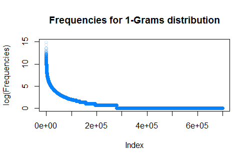

Modeling the Predictive Keyboard
--------------------------------

This markdown file will describe the steps for building the model for the project, written as I go through the tasks. The **main requirement** of this project is **"PREDICTIVE KEYBOARD: ...use the knowledge you gained in data products to build a predictive text product..."**. Basically, based on a pre-constructed predictive model and the current text written, the *predictive keyboard* should propose believable *following* words. 

Deliverables:  
* A predictive text model to test on a real data set  
* A reproducible R markdown document describing your model building process (this document)  
* A data product built with Shiny or Yhat to demonstrate the use of your product    
 

Introduction 
------------
The project is an exercise in building a predictive model for text input using a keyboard. The predictive model could be a combination of probabilistic models (N-grams, others), and rule-based models (which, in general, could also be modeled using probabilities). For various tasks of the keyboard, different models will be used. 

In general, there are several sources of variability in regards to the possible *following* words. The sources, in short, could be imagined as being the **context** of the respective text (the text currently written, using the keyboard). From the factors defining the context, one could enumerate:  
* **the language** the text is written in. English vs. Russian, etc. The models should be sensitive to the respective language. For this project, I'll focus on the English corpus. A similar analysis and product could be re-created for the other languages, with the extra attention given to Unicode treatment.  
* **the application** in which the text will appear. In this case, the 3 possibilities are Twitter, Blogs, News. Consider the amount of data, I'll treat them the same way (analyze the whole corpus and extract the needed information for all applications).    
* **the subject** of the text. Ideally, the keyboard would be able to detect, in general terms, what the text is about (some high frequency words after removing the stopwords), and based on this information, to *push* some other possible *following words* in front (meaning giving them a higher probability). A probabilistic model involving groups of words, usually used together in texts, could be employed.    
* **the grammar** of the language or of the person. This would be more difficult to model in general (and also would probably fail in case of Twitter or News, which involve some loose grammar or journalistic style), but hopefully N-grams will be helpful enough (where N is 4 or 5, but comparisons with shorter N-grams could be also done, and see if they're just as "good").  
* **the vocabulary** of the user. In this case, we don't really have users (the data given is not associated with users), but the problem is similar to the *subject*, meaning that users tend to use the same words in regards to same subjects. The keyboard, after a while, could, in theory, use the text input to *learn* the user's specifics.  


The workflow
------------

**As a general approach**, I'll start by creating a simple N-gram probabilistic model, by putting the texts together, creating the N-grams, and getting a measure of its accuracy (start with a 2-gram model). I'll use this model as a baseline. I'll continue by trying some improvements, including smoothing, back-off strategy or linear combination of N-grams. A measurement of accuracy will be done here also, and a statistical significance comparison will be attempted (comparison of proportions of accurate selections vs. the length of the text written - frankly, with such a huge corpus, hard to believe will NOT be statistically significant, so maybe a question of practical significance should be attempted). 

Steps:   
1. Remove profanities from files  
  * A new set of files in a folder called **1_clean**, called "clean_en_US.blogs.txt", etc  
  * At same time, remove most punctuation and lower case everything (prepare for N-grams analysis)   
2. Break the files, get a training corpus, a test corpus, and a smaller corpus for a possible cross-validation step.  
  * A new set of files, in folders **2_train**, **2_test**, **2_cross**. The sizes will follow the percentages 70% for training, 20% for testing, 10% for cross validation.  
  * The process of splitting will be a simple one, break the files in somewhat equal 10 sizes. Pick randomly from these pieces, 2 for testing and 1 for cross-validation, the rest will be the training set. While in general a more precise method should be used, in this case I think this method will be enough, meaning that the collection of blogs/news/tweets is already pretty mixed, more like a "cluster" than a "stratum". Picking "clusters" (chunks) from files will keep the variability of the possible features constant (and high).  
3. Get a language model based on the training corpus. Create 1-, 2-, 3-, 4-grams. Depending on the time, try a 5-grams. Check what's the distribution of frequencies (at some point the difference between frequencies will probably plateau, meaning that the N-grams will be unique, so no decision power at that point).  
4. measure the accuracy of the model on the test corpus.  
5. Get a model based on back-off. Get a measure of accuracy on the test corpus.  
6. Get a model based on smoothing techniques. Get a measure of accuracy on the test corpus.  
7. Compare all models, draw conclusion.  


Task 0 - Understanding the problem
----------------------------------

a). What data do we have?  
* 4 sets of files, containing samples of tweets, blogs and news, in English, German, Finnish and Russian. 
Some basic data, word counts, etc (used *wc* command, recursively). 

```html
  lines       words     file
 371440    12653185    .//de_DE/de_DE.blogs.txt
 244743    13219388    .//de_DE/de_DE.news.txt
 947774    11803735    .//de_DE/de_DE.twitter.txt
 899288    37334690    .//en_US/en_US.blogs.txt
1010242    34372720    .//en_US/en_US.news.txt
2360148    30374206    .//en_US/en_US.twitter.txt
 439785    12732013    .//fi_FI/fi_FI.blogs.txt
 485758    10446725    .//fi_FI/fi_FI.news.txt
 285214     3153003    .//fi_FI/fi_FI.twitter.txt
 337100     9691167    .//ru_RU/ru_RU.blogs.txt
 196360     9416099    .//ru_RU/ru_RU.news.txt
 881414     9542485    .//ru_RU/ru_RU.twitter.txt
```

b). What are the standard tools and models?  
* documentation
    * *Text mining infrastucture in R*: http://www.jstatsoft.org/v25/i05/
    * *CRAN Task View: Natural Language Processing*: http://cran.r-project.org/web/views/NaturalLanguageProcessing.html
    * Coursera course on NLP (not in R): https://class.coursera.org/nlp
    * stemmers, stopwords, various helping info at http://snowball.tartarus.org
    
* libraries
    * *Text Mining* R library, mentioned above
    * *OpenNLP*, Java library for Natural Language Processing
    * *Weka*, open source Java product for various Data Mining and Artificial Intelligence algorithms. The R library mentioned above does integrate with the other two. 

* models
    * the immediate model for predicting following words one could think of is the N-grams: Markov probabilistic model for associating a certain probability to words, depending on the previous (N-1) words. 
    * for selecting the language and/or switching languages, a simple rule based model could be imagined: based on the stopwords typed with the keyboard, decide the language. Allow for changing on the fly, depending on changing the overall count of stopwords in a certain language. Another idea on this line, the model could flip between languages based on the N-grams ("a 4-Gram with a different language word at the end maybe should take into consideration 3-, 2-grams instead of an non-existing 4-Gram"). 
    * a model based on more and more input from a user should be designed - the users have different "styles" (vocabularies, N-grams, subjects of conversation), so the keyboard should, in general, allow for a user-specific model. This should evolve based on accumulating more input, and the keyboard should behave based on the simple rule "is the N-gram in the user model? If not, use the general model..." (to be determined). 
  
**Questions**  

* *What do the data look like?* The data seems to be text pieces extracted from Tweets, blogs, news.
* *Where do the data come from?* HC Corpora (www.corpora.heliohost.org).
* *Can you think of any other data sources that might help you in this project?*
    * Vocabularies. This would make the parsing of the samples more robust, in the sense that the misspellings would be corrected while parsing the text, and we would get more correct counts for various statistics. 
    * Stemmers, Part of Speech analyzer, Grammars. Working with the stemmer, would be able to extract grammar related rules, and make a more educated guess in regards to the next possible word. 
    * N-grams database from Google. Would work together with the N-grams derived from the data given here. 
    * It would be nice to have the data split "per user". Different users will have different "styles", and also would have a certain set of subjects they discuss about (guess-able from the most frequent words used - after removing the stopwords). The predictive keyboard *could* implement a learner which takes into consideration the previous user's texts, which would work in conjunction with the more general one. 
* *What are the common steps in natural language processing?* 
    * Tokenization: stemming, punctuation, analysis of linked and contracted words ("it's", "-"). 
    * Sentence and structure detection: deal with punctuation. 
    * Part of speech tagging, normalization: resolve ambiguities related to poly semantic words. 
    * Named entity resolution: associate the word to a concept, use ontologies and synonyms. 
    * Parsing: find the structure of a sentence. 
    * Building a language model: use N-grams, rules, synonyms. Find a representation of the language model.
* *What are some common issues in the analysis of text data?* One could think of: language (each language has its own specifics), problems with stemming (conjugations, declensions), punctuation (ambiguities), grammar (improper), semantic ambiguities, negations.
* *What is the relationship between NLP and the concepts you have learned in the Specialization?* I would say that the most important connection is the statistic/probabilistic treatment of the language models (Markov chains, N-grams).

  
  
Task 1 - Data acquisition and cleaning
--------------------------------------

**Tasks**

* Tokenization - identifying appropriate tokens such as words, punctuation, and numbers. Writing a function that takes a file as input and returns a tokenized version of it.

```{r}
## function will parse a file and will write clean lines of that file in other file. 
## e.g. A call like cleanFile("meh.txt", "clean") will create the folder "clean" and inside
## a files - clean_meh.txt etc. This should not contain profanities (as defined above). 

## NOTE - please careful with the param, the function doesn't check them at all. 
cleanFile <- function(fileInput, folderOutput) {
  if (!file.exists(folderOutput)){
    ## create the folder if it doesn't exist
    dir.create(folderOutput)
  }
    
  ## get the lines from the file. 
  input <- file(fileInput, "rb", encoding = "UTF-8")
  lines <- readLines(input, skipNul = TRUE, encoding = "UTF-8")
  close(input)
  
  ## open a file for writing
  output <- file(paste(folderOutput, "/clean_", fileInput, sep=""), "w", encoding = "UTF-8")
  
  for (line in lines){
    line <- iconv(line, to = "UTF-8")
    ## readlines, clean them, write them in the new file. 
    cleanLine <- removeProfanities(line)
    writeLines(text = cleanLine, con = output)
  }
  
  close(output)
    
}
```

* Profanity filtering - removing profanity and other words you do not want to predict. 
The main idea here is to replace what is being perceived as profanity, with some predefined keyword. A personal choice here, using "(...)" instead of a profanity. Trivial replacement in the vector of tokens. Use the list at https://github.com/shutterstock/List-of-Dirty-Naughty-Obscene-and-Otherwise-Bad-Words/blob/master/en (a simplified subset of it). I used simple replacement instead of regular expression matching, for two reasons: 
      * the regular expressions matching will be also prone to errors (" *uck" or similar will also filter "duck")  
      * speed  

```{r}
library(stringi)

## list of profanities, reduced here for readability. The actual list used is much longer. 
profanities <- c("acrotomophilia", "anal", "anilingus", "arsehole")  
                 
## function, will remove profanities from a line and will return the line with no punctuation, 
removeProfanities <- function(line) {
  ## leave the # and ' alone
  ## tokens <- strsplit(line, "[~`!@$%^&*\\(\\)\\-_=+,<.>/?\\|\\{} \"]")
  tokens <- AlphabeticTokenizer(line)

  newline <- ""
  for (token in unlist(tokens)){
    if (token %in% profanities){
      newline <- paste(newline, "(...)")
    }
    else 
      newline <- paste(newline, stri_trans_tolower(token), sep=" ")
  }
    
  return(newline)
}

```

* there is some other stuff which could be probably cleaned
  * HTML tags
  * Unicode characters. These impose a treatment of ` or ', non-alphabetic characters, which should be probably removed (punctuation). 


**Questions**

* *How should you handle punctuation?* Start with a punctuation symbols set, a simple regular expression. As noted above, using Unicode in text will complicate somewhat the treatment. The punctuation, in general, could help with the parsing (but not necessarily with the N-grams construction. In this case I used a regex like [~`!@$%^&*\\(\\)\\-_=+,<.>/?\\|\\{} \"]
* *The data contains lots of times, dates, numbers and currency values. How to handle these? Are they useful for prediction?* Probably not that useful for the exact prediction the following word, but maybe useful for guessing the subject of the text. I choose to remove numbers from analysis. 
* *How do you find typos in the data?* By comparing with the vocabulary and some rules for stemming. 
* *How do you identify garbage, or the wrong language?* By an *admittedly long* series of unrecognized words. Not sure if one can make a clear distinction between "garbage" and "wrong language", unless we can be confident that we do have a complete set of languages defined in the system - if the text doesn't *belong* in any of the languages, then is *garbage*.
* *How do you define profanity? How do you ensure you don't remove words you want to include?* One could include a list of profanities with variations (some simplistic regular expressions might also work). Not sure a *minimal edit distance* approach would work, since would be very difficult, based on a minimal edit distance approach, to allow words like *duck* or so. 
* *How do you handle capital and lower cases?* Probably the simplest way is to lowercase everything in the model. They could play a role in part of speech analysis (names, etc, which should not be confused with some misspelled word). 
* *What is the best set of features you might use to predict the next word?*
    * N-grams (4- or 5-grams), learned from these files or from the user's input
    * Part of speech analysis (grammar rules for the respective language)
    * NOTE. the 4 and 5-grams will actually help a lot with the grammar as well, since most grammatical constructions will be well defined by 4 or 5 words expressions ("I .." is very often followed by a verb, etc). 


At the end of the profanity removal task, I'll have clean files, no punctuation, all in lower case. These files will be ready to be analyzed for N-gram extraction. 


Task 2 - Exploratory analysis
-----------------------------

**Tasks**

* *Exploratory analysis  - perform a thorough exploratory analysis of the data, understanding the distribution of words and relationship between the words in the corpora.*   
At this point we need a lib to start getting the N-grams out of the corpus. Using tm and RWeka, the code will look like: 

```{r}
## Java stuff
Sys.setenv(JAVA_HOME="")
options(java.parameters="-Xmx14g")
```
```{r cache=TRUE, eval=FALSE}
## create a tokenizer in RWeka
tokenizer <- function(x) NGramTokenizer(x, Weka_control(min = 1, max = 5))
## load a corpus from a folder
en_texts <- VCorpus(DirSource(directory="data/en_US/clean", encoding="UTF-8"), 
                    readerControl=list(language="en"))
## clean up text
en_texts <- tm_map(x=en_texts, FUN=removeNumbers)
## No need, punctuation already removed - en_texts <- tm_map(x=en_texts, FUN=removePunctuation)
## No need, all text is lower case - en_texts <- tm_map(x=en_texts, FUN=tolower)
## options(mc.cores=1)
## create a term document matrix, with the frequencies
tdm <- TermDocumentMatrix(en_texts, control=list(tokenizer=tokenizer))
```

**Note**: loading in parallel on RWeka/MacOS TermDocumentMatrix crashes with some obscure errors. Suggestion to use option mc.cores=1.  
**Note**: working on a "bigger" TermDocumentMatrix crashes the JVM behind RWeka, OutOfMemory. Suggestion to use option java.parameters="-Xmx4g" (heap size up to 4G)  
**Note**: rJava library has problems if the environment variable JAVA_HOME is set. So unset it before loading rJava or RWeka (Sys.setenv(JAVA_HOME=""))  


Some stats with regards to time required to analyze the whole corpus (English): 
```html
N-grams |    User   System    Elapsed  
------- | ---------------------------  
1-Gram  |  773.86     1.77     775.69   
2-Gram  |  916.21     5.79     902.12  
3-Gram  | 2179.20     8.42    2153.49   
4-Gram  | 2999.19     8.60    2969.92  
5-Gram  | 3285.18     8.86    3258.52  
```


*...Understand frequencies of words and word pairs - build figures and tables to understand variation in the frequencies of words and word pairs in the data.*

  * 1-Grams:  
    * Total different: ~443,000
    * Highest frequency: ~3.3 millions
    * Number of 1's (frequency == 1): ~229,000
    * 6 Most used: "the", "to", "and", "a", "i", "of", "in", "it", "that"  
  * 2-Grams:  
    * Total different: ~10 millions  
    * Highest frequency: ~300,000  
    * Number of 1's (frequency == 1): ~7.1 millions 
    * 6 Most used: "of the", "in the", "it's", "i'm", "to the", "for the"  
  * 3-Grams:  
    * Total different: ~32.7 millions  
    * Highest frequency: ~40,000  
    * Number of 1's (frequency == 1): ~27 millions   
    * 6 Most used:  "i don't", "one of the", "a lot of", "it's a", "i can't", "thanks for the"
  * 4-Grams:  
    * Total different: ~50 millions  
    * Highest frequency: 7898  
    * Number of 1's (frequency == 1): ~45.7 millions    
    * 6 Most used: "i don't know", "i'm going to", "can't wait to", "the end of the", "I don't think", "don't want to"
  * 5-Grams:  
    * Total different: ~55.7 millions  
    * Highest frequency: 2630
    * Number of 1's (frequency == 1): 53.7 millions (most of them are encountered only once)   
    * 6 Most used: "at the end of the", "i don't want to", "can't wait to see", "it's going to be", "i can't wait to", "don't know that"

As for a plot, I'll put just the 1-Grams plot (logarithm so we can see the "elbow"). The plots for the rest of the N-Grams will look VERY SIMILAR (except they have lower and lower frequencies, and longer and longer tails to the right - meaning more and more Grams with the count of 1). 




**Questions**

* *Some words are more frequent than others - what are the distributions of word frequencies?*  The distribution was described above, see the plot for 1-Grams.  
* *What are the frequencies of 2-grams and 3-grams in the dataset?* As described above, the distribution of 2- and 3-grams are very similar to the 1-Grams, with the difference that the max frequency is a lot lower (so the slope starts lower), and the tail to the right is a lot longer. 
* *How many unique words do you need in a frequency sorted dictionary to cover 50% of all word instances in the language? 90%?* For this I started with the frequency sorted dictionary and I calculated quantiles for 0.5, 0.9 and 0.99. See the *calculateQuantile* function underneath. The results: **107 (high frequency) words to cover 50% of the word instances, 6363 words to cover 90%, and 75607 to cover 99% of the word instances.**   
* *How do you evaluate how many of the words come from foreign languages?* A cross comparison of the low frequency words with a foreign language dictionary could be imagined. The "winner" is the one which has those words in the higher frequency.  
* *Can you think of a way to increase the coverage -- identifying words that may not be in the corpora or using a smaller number of words in the dictionary to cover the same number of phrases?* One could think of a using synonyms to reduce the overall number of words in the text. Suggestions could be given based on synonyms.  


```{r cache=TRUE, eval=FALSE}
## calculate quantiles, quick and dirty method. We have already a probability distribution, 
## in a vector, sorted decreasingly by probability. Loop through the elements, stop when
## the desired quantile is achieved. 

calculateQuantile <- function(distribution, quantile) {
  ## careful, no param checking here. 
  prob <- 0
  for (i in 1:length(distribution)) {
    prob <- prob + distribution[i]
    if (prob > quantile){
      print(prob)
      return(i)
    }
  }
}
```


Task 3 - Modeling
-----------------

*The goal here is to build your first simple model for the relationship between words. This is the first step in building a predictive text mining application. You will explore simple models and discover more complicated modeling techniques.*  


**Tasks**  
  
  * *Build basic n-gram model - using the exploratory analysis you performed, build a basic n-gram model (http://en.wikipedia.org/wiki/N-gram) for predicting the next word based on the previous 1, 2, or 3 words.* At this point I have all of the 1- to 5-Grams constructed, saved separately as files (some are >6GB when loaded in R, so playing with them becomes a problem). I might need to filter all of the N-Grams, so they contain only the Grams with frequencies > 1 (exception the 1-Grams, I'll use those as dictionary).   
  * *Build a model to handle unseen n-grams - in some cases people will want to type a combination of words that does not appear in the corpora. Build a model to handle cases where a particular n-gram isn't observed.*  I'll use a backoff strategy, if there is no suggestion for the last 4 words (using 5-Grams and associated probabilities), then use last 3, if not, last 2, if not, last 1, and, if still not, use the highest 1-Gram probabilities ("the", "end", etc).   
  
*Some tests with the N-gram models.*  
For these tests, I'll use 2 accuracy measurements.  
    * First, "estimate next word". Loop through the test corpus, for each word use the model to estimate next word. Use the model to return ONLY the highest probability one. Compare the model given answer with the actual word. Count the hits/misses, get accuracy.   
    * Second, "estimate next possible 3 words". This is different, in the way that a software keyboard could give the user several options in regards to the next possible word. In my case, I'll use 3 options. With this in mind, the process will be: parse the testing corpus, and for each word use the model to return 3 possibilities. If the actual next word is in those 3, consider it a "hit". Count hits and misses, calculate accuracy.  
    
* **1-Gram test, 1 possible word**. The test is done on a test file (not involved in training), length ~4 million words. **Accuracy: ~5%** (basically this model just counts the "the" words in the test vector).  
* **1-Gram test, 3 possible words**. Same test file, length ~4 million words. **Accuracy: ~10%** (this time counts "the", "to", "and").  
* **2-Gram test, 1 possible word**. Same test file, this time involve 2-Grams. 
* **2-Gram test, 3 possible word**. Same test file, this time involve 2-Grams. 


  
**Questions**  
  
  * *How can you efficiently store an n-gram model (think Markov Chains)?*  As suggested, a Markov Chain could be employed. Starting with the list of 1-Grams (probabilities of one-word together with the list of one-words), I could start parsing the 2-Grams. For each of the 2-Grams, add a "link" between the words, so the link represents the probability of the respective 2-Gram (and so on for the 3-, 4-, 5-Grams). The "paths" will have to be memorized, so the model works "forward", meaning that given a group of words, the model is quick to calculate the "next probable word". In regards to efficiency, and looking at the size of the problem, several things will have to be taken into consideration:  
    * Don't create other vectors with the actual words or Grams. These take a lot of space. Use "links", meaning indexes in the 1-Gram vector, to describe "next" word.  
    * The 1-Gram vector is ~700,000 words. So find the smallest integer type that will store these indexes.  
    * The model will contains Grams and several pieces of information for each Gram (probability of being on 1'st, 2'nd, 3'd positions, etc). I think something like this should work. TO BE TESTED. 
  * *How can you use the knowledge about word frequencies to make your model smaller and more efficient?* One idea is to completely drop a bunch of the "rarely seen" Grams (meaning for example the ones with frequency 1). This would mean dropping about 75% of the 2-Grams (I leave the 1-Grams as they are), more than 80% of the 3-Grams, almost 95% from the 4- and 5Grams.   
  * *How many parameters do you need (i.e. how big is n in your n-gram model)?* This model I'm building will go up to 5-Grams. Frankly, looking at the texts, it seems that there is little predictive power in the groups of 5 (usually the 5
'th word is already another stopword, so something that would come up higher anyway, with any of the 2/3/4-Gram models).     
  * *Can you think of simple ways to "smooth" the probabilities (think about giving all n-grams a non-zero probability even if they aren't observed in the data) ?* The literature[1] seems to point to several methods, Laplace, Good-Turing, Kneser-Ney methods.   
  * *How do you evaluate whether your model is any good?* I already broke the corpus into train, test and cross-validation. With the model built on train set, I intend to verify the accuracy of the model, in 2 accuracies measurements. 
    * First, "estimate next word". Loop through the test corpus, for each word use the model to estimate next word. Use the model to return ONLY the highest probability one. Compare the model given answer with the actual word. Count the hits/misses, get accuracy.   
    * Second, "estimate next possible 3 words". This is different, in the way that a software keyboard could give the user several options in regards to the next possible word. In my case, I'll use 3 options. With this in mind, the process will be: parse the testing corpus, and for each word use the model to return 3 possibilities. If the actual next word is in those 3, consider it a "hit". Count hits and misses, calculate accuracy.  
  * *How can you use backoff models (http://en.wikipedia.org/wiki/Katz's_back-off_model) to estimate the probability of unobserved n-grams?* In general, by using the less-grams model. The Katz model lets probabilities compete: the probabiliy of an N-gram, vs. a N-1-gram, adjusted by a factor. In case of a unobserved N-gram, we fall back to a N-1 grams, and, if this doesn't exist either, continue.. Worst case scenario, fall back on the probability of a 1-Gram.   


Task 4 - Prediction
-------------------

*The goal of this exercise is to build and evaluate your first predictive model. You will use the n-gram and backoff models you built in previous tasks to build and evaluate your predictive model. The goal is to make the model efficient and accurate.*   


**Tasks**  

* *Build a predictive model based on the previous data modeling steps - you may combine the models in any way you think is appropriate.*  
* *Evaluate the model for efficiency and accuracy - use timing software to evaluate the computational complexity of your model. Evaluate the model accuracy using different metrics like perplexity, accuracy at the first word, second word, and third word.*  


**Questions**  

* *How does the model perform for different choices of the parameters and size of the model?*   
* *How much does the model slow down for the performance you gain?*  
* *Does perplexity correlate with the other measures of accuracy?*  
* *Can you reduce the size of the model (number of parameters) without reducing performance?*   


Task 5 - Creative exploration
-----------------------------

*So far you have used basic models to understand and predict words. In this next task, your goal is to use all the resources you have available to you (from the Data Science Specialization, resources on the web, or your own creativity) to improve the predictive accuracy while reducing computational runtime and model complexity (if you can). Be sure to hold out a test set to evaluate the new, more creative models you are building.*

**Tasks**  

*Explore new models and data to improve your predictive model.*  
*Evaluate your new predictions on both accuracy and efficiency.*  

**Questions**

* *What are some alternative data sets you could consider using?*   
* *What are ways in which the n-gram model may be inefficient?*  
* *What are the most commonly missed n-grams? Can you think of a reason why they would be missed and fix that?*   
* *What are some other things that other people have tried to improve their model?*   
* *Can you estimate how uncertain you are about the words you are predicting?*  


Task 6 - Reproducible documentation of results
----------------------------------------------

*This task is to build the documentation describing how you came to your final predictive model. You should summarize efficiently your analysis and model building steps. The goal is to communicate everything you learned about the data set in a succinct way.*

**Tasks**  

*Create a reproducible report explaining your analysis - pay particular attention to keeping the report succinct and easy to follow. Be sure to tell a story.*  

**Questions**  

* *What parts of the data analysis should you report?*    
* *What order makes the most sense to help another person understand what you have done?*  
* *How do you balance completeness and efficiency? What are the "need to knows"?*  


Task 7 - Data Product
---------------------

*The goal of this exercise is to create a product to highlight the prediction algorithm that you have built and to provide an interface that can be accessed by others. You may choose to create either a prediction API through Yhat or a Shiny app.*  

**Tasks**  

*Create a data product to show off your prediction algorithm You may create either an API that accepts an n-gram and predicts the next word or a Shiny app that does the same thing.*  

**Questions**  

* *What are the most interesting ways you could show off your algorithm?*  
* *Are there any data visualizations you think might be helpful (look at the Swiftkey data dashboard if you have it loaded on your phone)?*  
* *How can you demonstrate the usefulness of your Yhat-based API?*   
* *How should you document the use of your data product (separately from how you created it) so that others can rapidly deploy your algorithm?*  


References
-----------

* [1] Natural Language Processing - Dan Jurafsky, Christopher Manning - https://class.coursera.org/nlp/lecture
* [2] Mining the Web, discovering knowledge from hypertext data - Soumen Chakrabarti
* [3] Wikipedia
* [4] Stemming algorithms, stopwords and resources at http://snowball.tartarus.org

